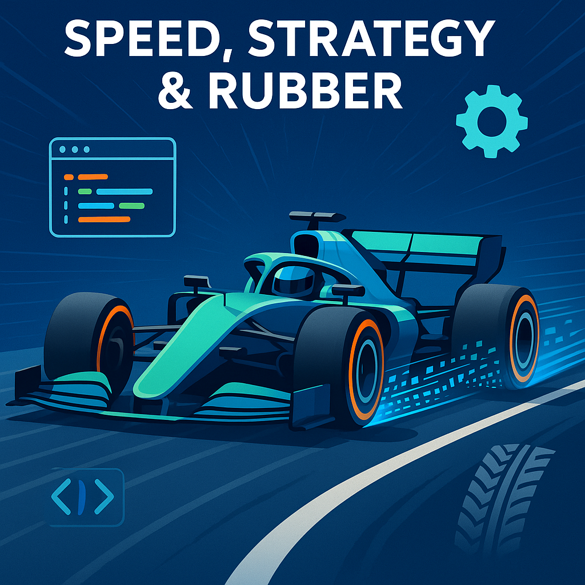

# Speed, Strategy & Rubber 🏎️💥

## 📋 Overview
Imagine you’re the lead software engineer for a Formula 1 team on race day. Your job is to build an on-track “tire strategist” that continuously monitors each tire’s wear, warns the driver when a blow-out is imminent, and recommends the perfect lap to pit (“box”) so valuable seconds aren’t wasted on overly cautious stops. In this multi-part project you’ll create the core simulation engine for that tool: a mini-game where every lap is a high-stakes gamble between squeezing out more performance and avoiding catastrophic tire failure.

Why is this interesting? Real F1 strategists juggle dozens of variables—tire compound, track temperature, driver style—to make split-second decisions that can win or lose a Grand Prix. By modeling just a few of those factors in Java, you’ll practice reading live-looking data from files, designing clean class hierarchies, and adding your own creative twists such as random weather changes or driver aggression levels. When you’re done, you’ll have a playable console game and a deeper appreciation of data-driven decision making under pressure.

## 🎯 Learning Objectives
By completing this task, you will:
- Read lap-by-lap telemetry data from a CSV file and use it to instantiate Tire objects dynamically.
- Design cohesive classes (e.g., Tire, Car, RaceEngineer) with clear responsibilities and interfaces.
- Apply creative programming techniques to add unpredictable race events and strategic depth.
- Handle file I/O exceptions gracefully to maintain simulation integrity.
- Practice incremental development: plan, sketch, code, test, and iterate.

## 📚 Prerequisites
Before starting this task, you should be familiar with:
- Java classes, objects, and basic inheritance
- Reading text files using java.io or java.nio
- Exception handling (try-catch, throws)
- An IDE such as IntelliJ IDEA or VS Code with a Java 17+ JDK installed

## 🚀 Getting Started
1. Clone the starter repository (link provided by your instructor) or download the ZIP.
2. Open the project in your IDE and run `Main.java`—you should see a placeholder menu.
3. Inspect `data/sample_telemetry.csv`; each row represents lap time, tire temperature, and track temp.
4. Skim the skeleton classes (`Tire.java`, `Car.java`, `RaceSimulator.java`)—they’re intentionally incomplete.

## Exercises

### Exercise 1: Rubber Meets Reality 📖
**⏱️ Estimated Time:** 20-30 minutes

**🎯 Goal:** Deepen your conceptual understanding of how real-world telemetry translates into object attributes and game decisions.

**📝 Instructions:**
Answer the following in a short written reflection (markdown or plain text):

1. Identify at least three physical properties of an F1 tire that meaningfully affect its lifespan. For each, suggest an appropriate Java data type and explain why.
2. Examine `data/sample_telemetry.csv`. Propose a parsing plan: which columns map to which Tire fields? What conversions (if any) are needed?
3. Tire blow-outs are rare but dramatic. Describe two algorithmic approaches for predicting the probability of a blow-out from wear and temperature data.
4. Consider edge cases: what should your program do if the telemetry file contains corrupt or missing values?

**💡 Hints:**
<details>
<summary>Click for hint</summary>

Think of the tire as a gradually degrading health bar. Temperature spikes or very long stints accelerate that degradation. Real engineers use both deterministic thresholds (e.g., >140 °C = danger) and stochastic models (probability curves). For file corruption, imagine a sensor glitch mid-race—you’d want the software to default to a safe assumption rather than crash.

</details>

**✅ Success Criteria:**
- [ ] Listed three tire properties with suitable data types and justifications
- [ ] Outlined a clear column-to-field mapping and required conversions
- [ ] Compared at least two blow-out prediction algorithms
- [ ] Proposed a sensible strategy for handling bad telemetry data

### Exercise 2: Blueprinting the Pit Wall 🔍
**⏱️ Estimated Time:** 30-40 minutes

**🎯 Goal:** Bridge theory to practice by designing the class architecture and data flow for the simulation.

**📝 Instructions:**
1. Draw a UML class diagram (hand-drawn and photographed is fine) featuring at minimum: Tire, Car, TelemetryReader, RaceEngineer, and RaceSimulator. Indicate relationships (composition, association) and key methods/fields.
2. Write a brief justification (3-4 sentences per class) explaining each class’s single responsibility.
3. Outline pseudocode for the main simulation loop that:
   a. Reads the next telemetry row  
   b. Updates tire wear and temperature  
   c. Checks for pit-stop recommendation  
   d. Ends the race when laps are exhausted or a blow-out occurs
4. Review the starter code and annotate where your planned methods will integrate. Use inline comments like `// TODO Exercise 2`.

**💡 Hints:**
<details>
<summary>Click for hint</summary>

Aim for high cohesion and low coupling. TelemetryReader should know about files, not tires. RaceEngineer makes decisions but doesn’t grind numbers—delegate calculations to Tire. Avoid “God classes” that do everything.

```java
public class TelemetryReader {
    public Optional<TelemetryData> nextLap() throws IOException {
        // Read CSV line → return TelemetryData or empty if EOF
    }
}
```

</details>

**✅ Success Criteria:**
- [ ] UML diagram includes required classes with correct relationships
- [ ] Justifications reflect the Single Responsibility Principle
- [ ] Pseudocode covers all four main loop steps logically
- [ ] Starter code annotated with clear TODOs that align with the design

### Exercise 3: Spinning Up the Tires 🏗️  
⏱️ Estimated Time: 45-60 minutes  

🎯 Goal: Turn raw CSV rows into fully-formed Java objects. You’ll write the TelemetryReader that parses each line, create a lightweight TelemetryData class to hold one lap’s values, and enhance the Tire class so it can be instantiated directly from that data.

📝 Instructions:  
1. Open `TelemetryReader.java`; you’ll see three TODO blocks. Complete them so the class  
   a. Opens the file passed into the constructor  
   b. Reads one line at a time with `BufferedReader.readLine()`  
   c. Converts each line into a `TelemetryData` object (see step 2)  
2. Create `TelemetryData.java` in `src/model`. It should store at minimum:  
   • lapNumber (int)  
   • tireTempCelsius (double)  
   • trackTempCelsius (double)  
   • lapTimeSeconds (double)  
3. In `Tire.java` add a new constructor that receives a `TelemetryData` instance and sets starting temperature and an initial wear value of 0.0.  
4. In `Main.java` (or a quick test harness) loop over the first five lines of the file and print each `Tire` you create.  

Expected console output (values will differ):  
```
Lap 1 → Tire{temp=93.5 °C, wear=0.00 %}
Lap 2 → Tire{temp=94.1 °C, wear=0.00 %}
Lap 3 → Tire{temp=94.9 °C, wear=0.00 %}
Lap 4 → Tire{temp=95.6 °C, wear=0.00 %}
Lap 5 → Tire{temp=96.3 °C, wear=0.00 %}
```

Starter code
```java
// TelemetryReader.java (excerpt)
public class TelemetryReader {
    private BufferedReader reader;

    public TelemetryReader(String filename) throws IOException {
        // TODO: initialize 'reader' here
    }

    public Optional<TelemetryData> nextLap() throws IOException {
        // TODO: read a line and return Optional.of(new TelemetryData(...))
        //       or Optional.empty() if end-of-file
    }

    public void close() throws IOException {
        // TODO: close the reader
    }
}
```

💡 Hints:  
<details>
<summary>Click for hint</summary>

1. Use `String.split(",")` for quick parsing.  
2. `Double.parseDouble(parts[2])` converts a String to double.  
3. Wrap I/O operations in `try/catch` but re-throw as needed so callers can handle errors.

```java
if (parts.length < 4) {
    throw new IOException("Malformed telemetry line: " + Arrays.toString(parts));
}
```
</details>

✅ Success Criteria:  
- [ ] `TelemetryReader.nextLap()` returns correct data for every row  
- [ ] `TelemetryData` encapsulates lap values with getters (no public fields)  
- [ ] New `Tire` constructor correctly initializes temperature and wear  
- [ ] Demo program prints five valid Tire instances without crashing  


### Exercise 4: The Heartbeat Loop 🔄  
⏱️ Estimated Time: 45-60 minutes  

🎯 Goal: Wire your objects together into a real-time simulation loop that updates tire wear, checks for danger, and logs each lap.

📝 Instructions:  
1. In `RaceSimulator.java` locate the `run()` method stub. Flesh it out so it performs:  
   a. `TelemetryData lap = telemetryReader.nextLap()`  
   b. `car.updateWithLap(lap)` (you’ll implement this in `Car.java`)  
   c. Ask `RaceEngineer.shouldPit(car)`; if true, print “BOX, BOX, BOX!”  
   d. Stop looping if `lapNumber > totalLaps` or `car.hasBlownTire()`  
2. Implement `Car.updateWithLap(TelemetryData)` to:  
   • Forward temperature to its `Tire` object  
   • Increase wear by an amount proportional to temperature and lap time  
3. In `Tire`, add `incrementWear(double delta)` and `boolean isBlown()` (true if wear ≥ 100 %).  
4. Run `Main.java`. You should see a lap-by-lap log similar to:  
```
Lap 12 | Temp 109.3 °C | Wear 64.2 % | SAFE
Lap 13 | Temp 110.1 °C | Wear 67.9 % | SAFE
Lap 14 | Temp 112.7 °C | Wear 72.5 % | BOX, BOX, BOX!
```

💡 Hints:  
<details>
<summary>Click for hint</summary>

• Keep the wear formula simple for now: `wear += (temp - 80) * 0.05`.  
• Use `String.format()` for neat console alignment.  
• Break big tasks into helper methods: `logLapStatus()`, `checkFinishConditions()`.
</details>

✅ Success Criteria:  
- [ ] Simulation prints every lap until race end or tire blow-out  
- [ ] Wear increases and eventually triggers a pit call or failure  
- [ ] No uncaught exceptions for normal input  
- [ ] Code follows SRP (Car handles state; RaceEngineer handles decisions)  


### Exercise 5: Pit-Stop Prophet 🚀  
⏱️ Estimated Time: 60-90 minutes  

🎯 Goal: Upgrade RaceEngineer into a data-driven strategist that reads configuration files, calculates blow-out probability, and chooses the optimal lap to pit.

📝 Instructions:  
Part A – Strategy Configuration  
1. Create `config/strategy.json` (or `.csv`) with keys such as:  
   • softTyreWearRate = 1.25  
   • hardTyreWearRate = 0.85  
   • basePitLossSeconds = 22.5  
2. Write `StrategyLoader.java` that reads the file at program start and populates a `StrategyConfig` object.

Part B – Probability Model  
3. In `Tire`, add `double blowoutRisk()` that returns a value between 0 and 1 using e.g.  
   `risk = Math.pow(wear / 100, 3) + (temp > 110 ? 0.1 : 0);`  
4. In `RaceEngineer`, implement `boolean shouldPit(Car car, int lapRemaining)` that decides to pit when:  
   • Expected time lost if the tire blows > expected pit-loss seconds  
   • Risk threshold is configurable in the strategy file

Part C – Resilience & Logging  
5. Wrap all file I/O in try-with-resources. If the config is missing, load sensible defaults and warn the user.  
6. Extend the lap log with the live blow-out probability. Example:  
```
Lap 18 | Temp 118.0 °C | Wear 85.4 % | Blow-out Risk 0.57 | BOX!
```

💡 Hints:  
<details>
<summary>Click for hint</summary>

• Use `java.nio.file.Files.readString(Path)` for quick JSON loading (or `BufferedReader` for CSV).  
• Consider delegation: `RaceEngineer` queries `StrategyConfig` instead of hard-coding numbers.  
• To parse simple JSON without external libs, you can hand-roll or store one key=value per line.
```java
Map<String, Double> cfg = Files.lines(Path.of("config/strategy.csv"))
                               .map(l -> l.split(","))
                               .collect(Collectors.toMap(a -> a[0], a -> Double.parseDouble(a[1])));
```
</details>

✅ Success Criteria:  
- [ ] Config file parsed and applied without crashing, even if missing keys  
- [ ] Blow-out probability reported every lap  
- [ ] `shouldPit` uses probability + pit-loss math, not a fixed lap count  
- [ ] Code is well-commented and unit-testable (hint: inject StrategyConfig)  


### Exercise 6: Choose Your Chaos 🌟  
⏱️ Estimated Time: 60-90 minutes  

🎯 Goal: Add a creative, student-chosen feature that enriches gameplay and demonstrates solid class design plus documentation.

📝 Instructions: Select ONE option below (or propose your own to the instructor). Implement it with clear Javadoc and integrate it into `RaceSimulator`.

Option A: Weather Wizard  
• Generate dynamic weather every 5 laps (sunny, cloudy, light rain, heavy rain).  
• Track temperature and tire wear rates adjust based on weather.  
• Display an ASCII weather icon in the lap log.

Option B: Driver Aggression Matrix  
• Add a `Driver` class with an aggression level (1-10).  
• Aggressive drivers set faster lap times but overheat tires more.  
• Allow changing aggression via a console prompt mid-race (“Push, push!”).

Option C: Live Telemetry Dashboard  
• Use `javafx` or a simple Swing panel to visualize tire wear and risk in real time.  
• Graph updates every lap; red-lines when risk > 0.6.  
• Keep the console output too—double feedback channels!

💡 Hints:  
<details>
<summary>Click for hint</summary>

Regardless of the option, remember: one class should own one responsibility. If you add weather, resist the urge to cram weather logic into Car; create `WeatherSystem` instead.

```java
/**
 * Calculates the lap-specific wear multiplier based on current weather.
 * @return multiplier >= 0.0
 */
public double getWearMultiplier() { ... }
```
</details>

✅ Success Criteria:  
- [ ] Feature implemented matches chosen option’s bullet points  
- [ ] Javadoc present for every new public class and method  
- [ ] No circular dependencies introduced  
- [ ] Feature can be toggled on/off via a config or command-line flag  
- [ ] Code passes existing tests and any new tests you add  


## 🎉 Submission Checklist

Before submitting, ensure you have:

- [ ] Completed all six exercises
- [ ] Simulation runs from `Main` without runtime exceptions
- [ ] Telemetry file parsing handles corrupt or missing lines gracefully
- [ ] Strategy config loads even when optional parameters are absent
- [ ] At least one creative extension from Exercise 6 is fully integrated
- [ ] All new public methods/classes include Javadoc
- [ ] Console output is readable and well-formatted
- [ ] Variable and method names follow Java camelCase / PascalCase conventions
- [ ] Git repository contains meaningful commit messages (≥ one per exercise)
- [ ] `README.md` describes how to compile, run, and play your mini-game  


## 🤔 Reflection Questions

1. How did modeling blow-out probability as a function of both wear and temperature change your pit-stop strategy compared with a simple wear threshold?  
2. Which class in your design was hardest to keep within a single responsibility, and how did you refactor (or wish you had)?  
3. If this simulation were expanded for real-time use on an actual pit wall, what performance or scalability concerns would arise, and how might you address them?  


## 📚 Additional Resources

• Oracle Java I/O Tutorial – docs.oracle.com/javase/tutorial/essential/io/  
• “The Mathematics of Tire Degradation in F1” (blog post) – tinyurl.com/f1-tire-math  
• OpenCSV (lightweight CSV parser) – opencsv.sourceforge.net/  
• JavaFX tutorials (for Option C) – openjfx.io/openjfx-docs/  
• SOLID Principles explained with Java examples – medium.com/solid-java  